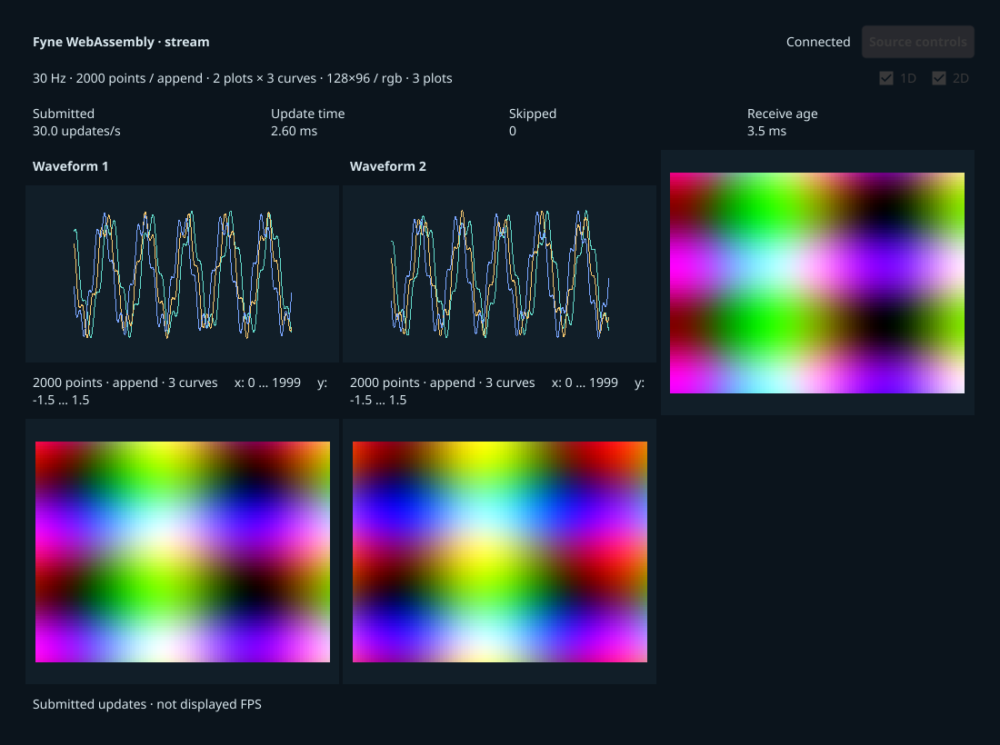

# Fyne WebAssembly frontend

`fyne-wasm` compiles the **Fyne 2.8.1** Go adapter to WebAssembly and displays its
canvas images through browser WebGL. It shares the locked
[`frontends/fyne`](../fyne/README.md) Go module, protocol decoder and CPU renderer
with the native `fyne` frontend. The benchmark ID, build and runtime metadata are
separate because Go's browser execution and rendering costs differ from its
native GLFW/OpenGL path.

This experimental frontend is available for local suites and is **not included
in the official baseline**. Its smoke scenario is a functional acceptance aid;
adding the scenario does not establish that all of its combinations are validated.
See [recorded platform validation](../../docs/validation.md) for actual coverage.



Visible Chromium QA at 1× scaling and 1100×820; captured after updates stopped and final
telemetry flushed, outside the measured interval.

## Setup and run

From the repository root with Go 1.27 or newer and Rust/Cargo installed:

```sh
./scripts/setup rust fyne-wasm
./scripts/plotbench doctor --frontends fyne-wasm --backends rust
./scripts/plotbench demo fyne-wasm
./scripts/plotbench demo fyne-wasm --mode replay
./scripts/plotbench run --suite scenarios/fyne-wasm-smoke.json --dry-run
```

The browser build does not require a native C compiler or Fyne's native OpenGL
development libraries. Setup installs the core browser support, builds the WASM
application using the existing Go dependency lock and supplies the matching Go
JavaScript runtime. It uses repository-local Go caches.
Build artifacts live in `frontends/fyne-wasm/dist`: `plotbench-fyne.wasm`,
`wasm_exec.js`, the browser loader and the Go license. The build uses
`GOOS=js GOARCH=wasm CGO_ENABLED=0` with `-mod=readonly`, `-trimpath` and
`release,no_animations` tags.
The runner serves the compiled application locally and launches a controlled
visible browser through Playwright. Select an existing browser explicitly with
`--browser-executable` when needed; see [platform setup](../../docs/setup.md).

For a Python-only source, install `fyne-wasm` without `rust` and select
`./scripts/plotbench demo fyne-wasm --backend python`. The smoke suite explicitly
selects both source backends, both stream and replay modes, and four workloads:
combined scalar, combined append/RGB with several plots and curves, waveform-only
and image-only. Its complete matrix is 16 runs, so preview it before execution.

## Rendering and timing

The shared renderer visits every sample of every waveform curve and rasterizes
the connecting segments into one CPU RGBA image per plot. It uses fixed axes,
the shared curve palette, a one-physical-pixel opaque stroke and no decimation.
Both append and replace workloads redraw the complete authoritative source window.
Scalar images use the exact source LUT; RGB frames are expanded to opaque RGBA.
Images use nearest-neighbour sampling and preserve the scientific image aspect
ratio. Multiple plot cards follow the shared equal-cell grid and naming rules.
The shared renderer reuses one RGBA buffer per image plot at unchanged dimensions
and converts every pixel on every adopted frame. It uses separate scalar/RGB loops
and a shared palette lookup. Allocation on first use or resize stays
inside conversion timing. All buffer writes occur in the serialized Fyne callback;
the standard Fyne image refresh, WebGL texture recreation and upload remain in use.
This does not cache converted replay frames or remove the browser/Go transport and
upload copies.

Setup enables `GOEXPERIMENT=simd` by default for 128-bit float32 SIMD scalar-image
conversion. It retains the shared palette while
allowing a one-entry rounding difference from the float64 scalar reference.
Every source pixel is still converted inside the measured interval. The kernel
and Go build settings are recorded in metadata; compare these builds separately.
This build requires browser WebAssembly SIMD support. Rebuild with
`GOEXPERIMENT=nosimd ./scripts/setup fyne-wasm` to select the scalar reference build.

`update_ms` includes all waveform rasterization, scalar/RGB conversion, image
assignment and Fyne canvas refresh submission for the whole frame.
`conversion_ms` measures the image conversions within that interval. Browser
texture upload and WebGL drawing happen later, outside the synchronous timer;
neither field measures GPU completion or screen presentation. Submitted updates/s
is not displayed FPS. Go's WebAssembly work and browser event processing also
compete for the browser's main thread.

The adapter renders authoritative protocol-v2 input from the shared source. Stream
transport uses the browser WebSocket API, copies received bytes into Go-owned
memory, decodes into the bounded latest-frame mailbox and acknowledges source
credit. This transport copy is outside `update_ms`. ACKs acknowledge input
delivery, not drawing. Replay preloads the centrally generated bounded CPU dataset
and cycles it without ordinary frame/config requests after preload; conversions
and refresh submissions still happen for each adopted update.

The browser launcher disables the Chrome DevTools Protocol `Network` domain on
Playwright's original browser session before loading the frontend. This avoids
copying binary WebSocket payloads as base64 through the automation transport.
It continues to observe startup and flushed completion through exposed lifecycle
bindings. Metadata records `browser_network_instrumentation: "disabled"`, and
reports keep this execution mode separate from older or monitored runs. The
launcher uses Playwright's bundled Node runtime and fails explicitly if the
installed Playwright cannot disable monitoring on its original session.

Duration starts after the first successful update. The controlled browser remains
open until final telemetry is exported, with the completion status available to
the runner. Keep the browser visible and foreground for measurements. Headless
checks establish function only. Keep browser executable/version, display scale,
viewport and graphics context fixed when comparing runs; do not pool these runs
with the native Fyne frontend or another browser context.

## Development

The shared Go tests and rendering contract are described in the
[native adapter README](../fyne/README.md). Browser-specific transport, launch and
completion behavior additionally need browser checks. Rebuild through
`./scripts/setup fyne-wasm` after changing Go or browser loader source; stale
build detection also includes the shared Go sources and dependency manifests.
The built application includes Go's `wasm_exec.js`; retain its BSD license and
the Fyne dependency notices when redistributing a build.

Browser transport tests run the actual WASM callbacks under Node using Go's
`go_js_wasm_exec`: they check decoding before acknowledgement, latest-frame
delivery, malformed-frame rejection and callback cleanup. CI runs these separately
from native Go tests and the browser lifecycle smoke.
