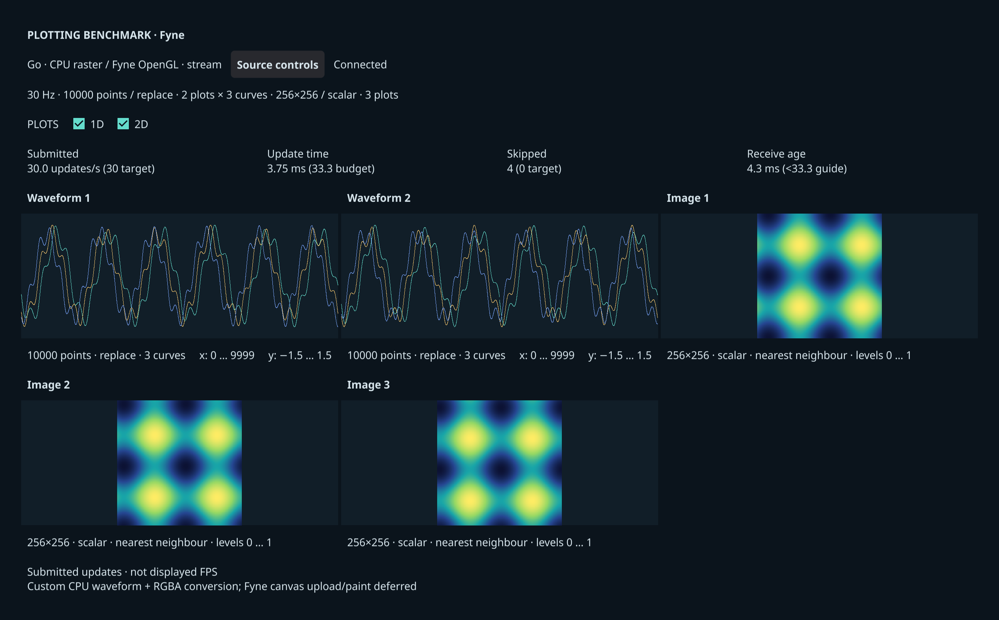

# Fyne frontend (Go)

Independent Go executable using **Fyne 2.8.1**, its GLFW/OpenGL desktop driver,
and Gorilla WebSocket. `go.mod` selects dependency versions and `go.sum` verifies
their contents. Go 1.26+ and a native C compiler are required. Setup keeps Go
modules and build caches inside the repository and builds with `release` and
`no_animations`; on Linux it also selects the `wayland` build tag.

From the repository root:

```sh
./scripts/setup rust fyne --dev
./scripts/plotbench doctor --frontends fyne --backends rust
./scripts/plotbench demo fyne
./scripts/plotbench demo fyne --mode replay
./scripts/plotbench run --suite scenarios/fyne-smoke.json --dry-run
```

The Python source is supported with `--backend python` for demos or
`--backends python` for campaigns. See [platform setup](../../docs/setup.md).
The scenario exercises both sources, both delivery modes, combined scalar and RGB
plots, and the two single-plot views. Preview before running it.
The Go tests cover the multi-plot path (several waveform plots with several
curves plus several images); to see it on screen run
`./scripts/plotbench run --suite scenarios/multi-plot-smoke.json --frontends fyne`
(that scenario's frontend list does not include fyne by default).

## Protocol v2: plots and curves



The capture above is untimed visual QA of the 2 × 3-curve + 3-image smoke workload on macOS (2× pixel ratio).

The decoder requires header `version == 2` and rejects v1 frames. The
configuration must carry `curves` (1 … 64), `waveform_plots` (1 … 16) and
`image_plots` (1 … 16), and every array must match the full-rank shape implied by
it exactly: `waveform` is float32 `[waveform_plots, curves, points]`, `image` is
float32 `[image_plots, height, width]` or uint8 `[image_plots, height, width, 3]`.
Offsets, contiguity, byte sizes and the 256 MiB replay bound are checked as before.
Plot `p` curve `c` and image plot `p` are re-sliced from the owned packet with
`Frame.waveformCurve` / `waveformPlot` / `imagePlot` — no copies.

The window holds one card per plot: `waveform_plots` waveform cards (only when the
view is not `image`) followed by `image_plots` image cards (only when the view is
not `waveform`), titled `Waveform` / `Image` for a single widget of that kind and
`Waveform 1`, `Waveform 2`, … / `Image 1`, … otherwise. The cards are laid out with
the shared rule: `n` visible plots fill a `container.GridWithColumns` with
`columns = ceil(sqrt(n))`, `rows = ceil(n / columns)`, row-major, equal cells;
trailing cells are padded with empty rectangles so they stay empty and equal
(n=2 → 2×1, n=3 → 2×2, n=5 → 3×2, n=9 → 3×3). The widget set is rebuilt when a
frame's generation changes the visible plot set (view, plot counts or curves);
Fyne lays the new cards out during the rebuild, so the first raster already uses
their real size. The HUD workload strip appends `· 2 plots × 3 curves` to the
waveform item when either exceeds 1 and `· 3 plots` to the image item when
`image_plots > 1`; waveform subtitles add `· K curves` when `curves > 1`.

Curve `c` of every waveform plot is stroked with the shared palette
`CURVE_COLORS[c % 8]` (`#64dccc`, `#f5c76e`, `#7aa6ff`, `#ff9d7a`, `#c39bff`,
`#9be564`, `#ff7ab8`, `#6ee7ff`), so curve 0 keeps the accent colour. Curves are
drawn in index order into the same image, so later curves overdraw earlier ones
where they cross; stroke width, fixed axes, no markers and no decimation are
unchanged for every curve.

## Rendering and timing

Fyne is a GUI toolkit, not a plotting library. This adapter implements custom
waveform rasterization: for every waveform plot it visits **every source sample of
every curve** and draws each connecting segment into one CPU RGBA image per plot
with an opaque, un-antialiased, one-physical-pixel Bresenham stroke in the curve's
colour. Axes have fixed x=[0,points−1], y=[−1.5,1.5] bounds shared by all curves of
a plot. Endpoint labels identify those ranges; there are no tick marks or grid
lines. Full rolling windows replace the previous image in both replace and append
modes. No point markers, decimation or incremental history are used. The raster
cost therefore scales with `waveform_plots × curves × points` plus the pixel area
of every plot cell.

Each image plot is expanded from its own contiguous block: scalar images to RGBA at
source resolution using the source's exact 256-entry LUT and
`floor(clamp(value,0,1)*255)`, RGB arrays copied to RGBA with opaque alpha. Fyne
`canvas.Image` presents every texture using nearest-neighbour sampling; the
scientific images retain their aspect ratio. Only the currently adopted CPU images
are submitted to Fyne, including during cyclic replay.

One update per frame covers every plot. `update_ms` includes the CPU rasterization
of every waveform plot, the conversion of every image plot, assignment and canvas
refresh submission of all cards. `conversion_ms` is the sum of all image-plot RGBA
conversions inside that interval. Fyne performs texture upload and OpenGL drawing
later; no GPU completion or presentation measurement is claimed. This boundary
includes more CPU work than a setter-only adapter and less than a synchronous
raster-and-blit path. Submitted updates/s is **not displayed FPS**.

## Transport, controls and metadata

The receiver decodes authoritative frames outside the UI, offers into one latest
slot, then ACKs the source sequence and generation. The UI also permits only one
pending update callback. Skips are measured between adopted frames in the same
generation. Stream reconnects increment `receiver_connection_epoch` and therefore
invalidate recorded comparisons. Replay validates and retains at most 256 MiB of
CPU packets, schedules against a monotonic clock, cycles changing payloads, and
uses an independent increasing presentation sequence. It makes no ordinary
frame/config requests after preload. The 1D/2D controls post explicit view changes;
replay then reloads centrally generated frames. Controls are disabled for recorded
runs; external stream workload changes remain visible in generation/config metadata.

Duration starts after the first successful submission. Metrics batch approximately
once per second with a bounded 4096-sample buffer, and always flush final metadata,
even without samples. Export failures count unconfirmed samples and make the
executable fail. Closing the window or receiving SIGINT/SIGTERM closes the source
and reports user termination. Replay receive age and unobserved draw timings stay
unavailable.

Metadata records Fyne/Go versions, physical pixel ratio (including Retina texture
scaling via `PixelCoordinateForPosition`), logical viewport, physical plot
areas, renderer overrides and compiled display protocol. `plot_viewports` is the
physical data area of the **first** plot of each kind (all grid cells are equal;
`null` for a kind hidden by the view), `plot_counts` the visible widget counts
(0 when hidden) and `curves` the curves per waveform plot. Fyne's public canvas API
does not expose monitor identity, physical refresh or absolute window position;
these remain unknown and require operator `--display-context`. Windows start
centered. The HUD refreshes around 2 Hz; a slow render limits its refresh too.

## Tests and visual QA

```sh
export GOPATH="$PWD/.cache/go"
export GOCACHE="$PWD/.cache/go-build"
go -C frontends/fyne test -race -tags ci ./...
go -C frontends/fyne vet -tags ci ./...
```

`ci` selects Fyne's test driver for functional checks only. The tests cover packet
validation/layout (version 2 only, full-rank shapes, plot and curve limits, missing
plot fields), zero-copy plot/curve slicing, authoritative append windows, malformed
replay, per-plot LUT/RGB conversion, full-data raster endpoints, per-curve colours
and overdraw order, the grid-columns rule with equal padded cells, card order and
titles after a rebuild, workload/subtitle suffixes, mailbox skips, WebSocket ACK
and shutdown, replay scheduling and final/error telemetry. Native visible validation is separate.
`--screenshot PATH` captures and closes an **untimed demo** after two seconds;
it is rejected for a non-demo run or positive duration. Screenshots are canvas QA,
not evidence of compositor presentation.

See [validation](../../docs/validation.md) for actual platform coverage. Linux
requires a native Wayland desktop and is not validated by macOS or `ci` tests.

References: [Fyne canvas images](https://docs.fyne.io/canvas/image/),
[Fyne threading](https://docs.fyne.io/started/goroutines/),
[build tags](https://docs.fyne.io/explore/compiling/).


