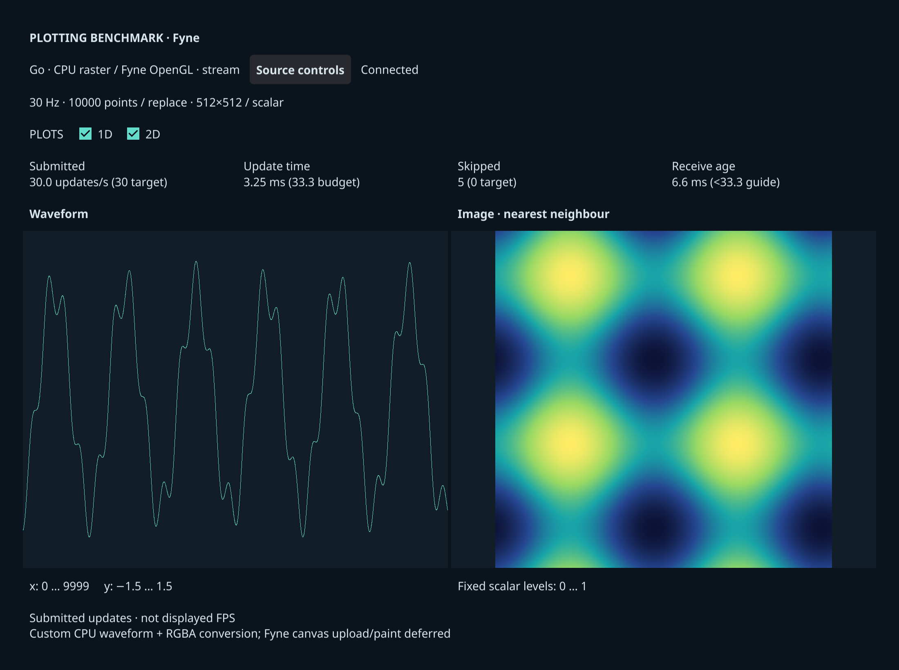

# Fyne frontend (Go)

Independent Go executable using **Fyne 2.8.1**, its GLFW/OpenGL desktop driver,
and Gorilla WebSocket. `go.mod` selects dependency versions and `go.sum` verifies
their contents. Go 1.26+ and a native C compiler are required. Setup keeps Go
modules and build caches inside the repository and builds with `release` and
`no_animations`; on Linux it also selects the `wayland` build tag.

From the repository root:

```sh
./scripts/setup rust fyne --dev
./scripts/plotbench doctor --frontends fyne --backends rust
./scripts/plotbench demo fyne
./scripts/plotbench demo fyne --mode replay
./scripts/plotbench run --suite scenarios/fyne-smoke.json --dry-run
```

The Python source is supported with `--backend python` for demos or
`--backends python` for campaigns. See [platform setup](../../docs/setup.md).
The scenario exercises both sources, both delivery modes, combined scalar and RGB
plots, and the two single-plot views. Preview before running it.

## Rendering and timing

Fyne is a GUI toolkit, not a plotting library. This adapter implements custom
waveform rasterization: it visits **every source sample** and draws each connecting
segment into a CPU RGBA image with an opaque, un-antialiased, one-physical-pixel
Bresenham stroke. Axes have fixed x=[0,points−1], y=[−1.5,1.5] bounds. Endpoint
labels identify those ranges; there are no tick marks or grid lines. Full rolling
windows replace the previous image in both replace and append modes. No point
markers, decimation or incremental history are used.

Scalar images are expanded to RGBA at source resolution using the source's exact
256-entry LUT and `floor(clamp(value,0,1)*255)`. RGB arrays are copied to RGBA with
opaque alpha. Fyne `canvas.Image` presents both textures using nearest-neighbour
sampling; the scientific image retains its aspect ratio. Only the currently
adopted CPU images are submitted to Fyne, including during cyclic replay.

`update_ms` includes full-waveform CPU rasterization, image conversion, assignment
and canvas refresh submission. `conversion_ms` measures source-image RGBA
conversion inside that interval. Fyne performs texture upload and OpenGL drawing
later; no GPU completion or presentation measurement is claimed. This boundary
includes more CPU work than a setter-only adapter and less than a synchronous
raster-and-blit path. Submitted updates/s is **not displayed FPS**.

## Transport, controls and metadata

The receiver decodes authoritative frames outside the UI, offers into one latest
slot, then ACKs the source sequence and generation. The UI also permits only one
pending update callback. Skips are measured between adopted frames in the same
generation. Stream reconnects increment `receiver_connection_epoch` and therefore
invalidate recorded comparisons. Replay validates and retains at most 256 MiB of
CPU packets, schedules against a monotonic clock, cycles changing payloads, and
uses an independent increasing presentation sequence. It makes no ordinary
frame/config requests after preload. The 1D/2D controls post explicit view changes;
replay then reloads centrally generated frames. Controls are disabled for recorded
runs; external stream workload changes remain visible in generation/config metadata.

Duration starts after the first successful submission. Metrics batch approximately
once per second with a bounded 4096-sample buffer, and always flush final metadata,
even without samples. Export failures count unconfirmed samples and make the
executable fail. Closing the window or receiving SIGINT/SIGTERM closes the source
and reports user termination. Replay receive age and unobserved draw timings stay
unavailable.

Metadata records Fyne/Go versions, physical pixel ratio (including Retina texture
scaling via `PixelCoordinateForPosition`), logical viewport, physical plot
areas, renderer overrides and compiled display protocol. Fyne's public canvas API
does not expose monitor identity, physical refresh or absolute window position;
these remain unknown and require operator `--display-context`. Windows start
centered. The HUD refreshes around 2 Hz; a slow render limits its refresh too.

## Tests and visual QA

```sh
export GOPATH="$PWD/.cache/go"
export GOCACHE="$PWD/.cache/go-build"
go -C frontends/fyne test -race -tags ci ./...
go -C frontends/fyne vet -tags ci ./...
```

`ci` selects Fyne's test driver for functional checks only. The tests cover packet
validation/layout, authoritative append windows, malformed replay, LUT/RGB
conversion, full-data raster endpoints, mailbox skips, WebSocket ACK and shutdown,
replay scheduling and final/error telemetry. Native visible validation is separate.
`--screenshot PATH` captures and closes an **untimed demo** after two seconds;
it is rejected for a non-demo run or positive duration. Screenshots are canvas QA,
not evidence of compositor presentation.

See [validation](../../docs/validation.md) for actual platform coverage. Linux
requires a native Wayland desktop and is not validated by macOS or `ci` tests.

References: [Fyne canvas images](https://docs.fyne.io/canvas/image/),
[Fyne threading](https://docs.fyne.io/started/goroutines/),
[build tags](https://docs.fyne.io/explore/compiling/).


