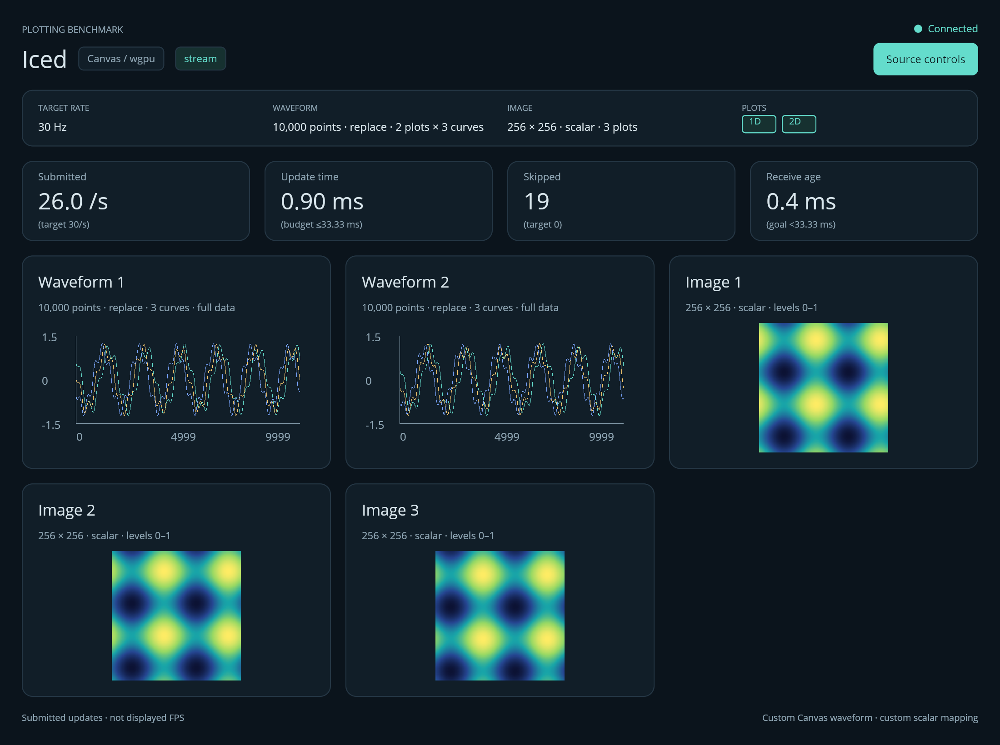

# Iced frontend

Independent Rust package and `plotbench-iced` executable. This adapter uses the
released **Iced 0.14.0**, with the wgpu renderer, one custom Canvas program per
waveform plot and one Iced image widget per image plot (protocol v2 multi-plot,
multi-curve workloads). `Cargo.lock` fixes the complete dependency resolution.
Python and Node dependencies are not required by this frontend.

From the repository root, install the frontend and default Rust source:

```sh
./scripts/setup rust iced
./scripts/plotbench demo iced
```

To use Python input, install just `iced` and select
`./scripts/plotbench demo iced --backend python`.
Rust/Cargo is still required to build the Iced frontend.

For a direct build and launch, keep working from the repository root with a Rust
toolchain installed:

```bash
export CARGO_HOME="$PWD/.cache/cargo"
cargo build --manifest-path frontends/iced/Cargo.toml --locked --release
frontends/iced/target/release/plotbench-iced --url http://127.0.0.1:8765
# Close the streaming demo before launching replay:
frontends/iced/target/release/plotbench-iced --mode replay --run-id iced-replay --duration 35
```

Before using a manual build through `./scripts/plotbench`, record its provenance
with `.envs/plotting-benchmark/bin/python -m plotbench.provenance iced`.
`./scripts/setup iced` performs both steps automatically.

Start the shared source in another terminal before a direct launch, using the
root project's instructions. `serve` defaults to Rust; use `serve --backend python`
for Python.
All frame generation and workload configuration belong to that source. Change its
configuration through the shared controller or `POST /api/config`. Stream mode
adopts the next frame's configuration. The **1D** and **2D** buttons under **PLOTS**
send a view-only update to that same source; selected buttons reflect the actual
frame configuration. At least one plot stays enabled. The buttons are disabled
while a change is pending and during recorded runs (`--duration > 0`), with
tooltips explaining why.

In replay mode, these buttons also fetch a replacement central CPU dataset and
swap it into the replay loop when ready. Failures leave the current dataset and
selection visible, with an inline error. The source control worker has one bounded
request slot; all HTTP work runs off the UI thread. Each replay dataset is bounded
to 256 MiB; a reload temporarily retains the previous dataset alongside the new
container and parsed packets. Replay does not poll for external source changes:
restart it after changing other settings through the shared controller.

The standard options are `--url`, `--mode stream|replay`, `--run-id`, `--duration`,
`--width`, and `--height`. Duration is measured from the first successful frame
submission; zero leaves the window open. The resizable window defaults to
1100 × 820 logical pixels and enforces a minimum of 860 × 640. Use **release**
binaries for every comparison. Build output remains in `frontends/iced/target/`;
the commands above keep dependency downloads in the root `.cache/cargo/`. Both
are ignored by Git.

For visual QA, add `--screenshot frontends/iced/target/iced.png --duration 6` to capture the
actual Iced window to PNG after four seconds of data, between HUD refreshes. This
causes extra GPU readback and PNG encoding; omit it from benchmark measurements. Screenshot use
is recorded in metadata.

The presentation uses the shared dark benchmark palette, a workload strip, four
live metric columns, and equally sized plot cards. The **Source controls** button
opens the configured source URL with `open` on macOS or `xdg-open` on Linux,
passing the URL as a direct argument. Actual plot dimensions continue to be
recorded after resizing; hold the window size fixed during measurements. Resizing
fits the existing Canvas paths until the next data update replaces them, with the
same physical stroke width.

## Plots, curves and layout (protocol v2)



The capture above is untimed visual QA of the 2 × 3-curve + 3-image smoke workload on macOS (2× pixel ratio).

The frame header's `waveform_plots`, `curves` and `image_plots` decide what is
rendered; the widget set is rebuilt whenever an adopted frame changes those counts
(a new generation), otherwise the Canvas programs are reused and only their paths
are replaced.

- **Waveform plots**: one Canvas program per plot. Each holds `curves`
  `canvas::Path` values built from the plot's `(plot, curve)` slice of the 3-D
  `[waveform_plots, curves, points]` array, sliced without copying. Every curve is
  stroked with the same one-physical-pixel width; the axes, ticks and labels are
  drawn once per Canvas. Curve `c` uses the shared palette `CURVE_COLORS[c % 8]`
  (`#64dccc`, `#f5c76e`, `#7aa6ff`, `#ff9d7a`, `#c39bff`, `#9be564`, `#ff7ab8`,
  `#6ee7ff`; curve 0 keeps the accent colour), all sharing the fixed y range
  [-1.5, 1.5] and x range [0, points-1].
- **Image plots**: one RGBA conversion and one `iced_runtime::image::allocate`
  request per plot, issued together as a `Task::batch`. A frame is adopted only
  when **every** image plot's allocation has completed for the same frame
  identity; stale, duplicate or out-of-range completions are discarded. The
  20-second allocation timeout applies to the whole frame. An allocation
  *error* is fatal only for the frame that would still be adopted (the readiness
  tracker confirms it is the completing identity); an error for a frame that a
  newer generation has already superseded is logged to stderr and discarded so
  the run continues with the next frame.
- **Configuration validation**: `Config::validate()` (curves 1..64,
  `waveform_plots` and `image_plots` 1..16, Hz, points, append count, modes and
  view) runs on every packet header and on the boot `/api/config` fetch. An
  out-of-range boot configuration fails loudly with the same message instead of
  being clamped.
- **Layout rule** (shared with every frontend): visible plots are ordered waveform
  plots first (`Waveform 1..N`), then image plots (`Image 1..M`), with `n = N + M`
  counting only the kinds enabled by `view`. They fill a grid of
  `columns = ceil(sqrt(n))` and `rows = ceil(n / columns)` row-major, built from
  nested `column!`/`row!` widgets with equal `Fill` cells; trailing cells of the
  last row hold empty `space()` so every cell keeps the same size (n=1 → 1×1,
  n=2 → 2×1, n=3–4 → 2×2, n=5–6 → 3×2, n=9 → 3×3).
- **Titles**: `Waveform` / `Image` when there is exactly one of that kind, else
  `Waveform 1`, `Waveform 2`, … / `Image 1`, …. Waveform subtitles gain `· K curves`
  when `curves > 1`. The workload strip shows `10,000 points · replace · 2 plots ×
  3 curves` when plots or curves exceed one and `256 × 256 · scalar · 3 plots`
  when `image_plots > 1`.
- **Metadata**: `plot_viewports` / `plot_viewports_logical` record the data area of
  the **first** plot of each kind (all cells are equal), `plot_counts` the visible
  counts (`0` for a kind hidden by `view`) and `curves` the curves per waveform
  plot.

## Workload and engineering cost

The source transmits a complete authoritative rolling window in append mode and a
complete new waveform in replace mode. Both are applied as full-window Canvas
path replacements for every curve of every waveform plot; this adapter does not
claim a specialized append operation. Every supplied sample becomes a path vertex,
with fixed axes, no decimation, no point markers, and a one-physical-pixel opaque
stroke. Display pixel ratio is queried from the actual window and recorded. Each
built-in nearest-neighbor image widget receives a new allocated RGBA handle for
every adopted frame. RGB input is expanded to RGBA; scalar input uses the central
256-entry LUT with index `floor(clamp(value, 0, 1) * 255)` and fixed levels `[0, 1]`.
The cost therefore scales with `waveform_plots × curves` paths (tessellated in as
many Canvas caches) and `image_plots` conversions plus allocations per frame.

Images use Iced's explicit allocation API before adoption. The last ready
`Allocation` of every image plot stays alive until the complete replacement frame
is ready; Iced may otherwise skip drawing a fresh handle while its asynchronous
upload is pending. There is at most one preparation (covering all plots of one
frame) in flight and one replaceable newest CPU candidate, in addition to the
receiver's latest mailbox. New source generations invalidate pending
older work; a receiver-connection epoch also rejects work from a disconnected source
while allowing a restarted source to reset its wire sequence/generation. The epoch is
recorded in metadata; a timed run with a reconnect should be repeated. Same-generation
uploads can complete even when a newer candidate exists,
so continuous input cannot starve adoption. All waveform plots and all image plots
of a packet are adopted together. Allocation errors or a 20-second whole-frame
timeout end the run with error metadata. Shutdown discards queued candidates and ignores late completions.

The pinned `iced_runtime::image::allocate` API is used directly because Iced's
convenience re-export is gated by its `image` feature. Keeping `image-without-codecs`
avoids adding image-file codecs to this raw-RGBA benchmark. The image widget and
allocation machinery are supplied by Iced; custom work remains the plotting and
conversion described here.

**Iced is a GUI toolkit, not a ready-made scientific plotting library.** The curves,
fixed axes, tick placement, coordinate mapping, plot grid, and scalar colormapping
are custom application code. That extra implementation and maintenance work is a disadvantage
of this solution. Zoom, pan, scientific tick formatting, selection, colorbars, and
plot export would require further work. These features are outside the common
streaming baseline, and are not implicitly provided by this example.

## What the measurements mean

- `update_ms`: synchronous CPU input conversion, path creation for every curve of
  every waveform plot, scalar/RGB-to-RGBA conversion of every image plot, and
  ready-frame adoption. Allocation waiting is excluded.
- `conversion_ms`: the conversion/path/image-handle portion of that same interval,
  covering all plots of the frame.
- `update_complete_ms`: elapsed time from selecting a packet for preparation to
  adopting the complete ready frame. This includes allocation and event-loop waiting
  for every image plot. It excludes waiting in the receiver/candidate mailbox and
  later drawing; it is neither pure CPU cost nor physical presentation time.
- `image_upload_wait_ms`, for images: the first allocation request of the frame to
  the processing of its last completion message. This includes upload-queue, GPU
  and UI scheduling; it is not a GPU timer.
- `draw_ms`, when observed: the sum of the subsequent Canvas geometry-cache
  generations of every waveform plot, including fixed axes/text and stroke
  tessellation of all curves. It is recorded only when every waveform Canvas
  reported a generation matching the frame sequence. It excludes image drawing,
  renderer scheduling, GPU upload, GPU completion, and physical presentation. A
  missing value means at least one Canvas generation callback was not observed
  before the next update; image-only runs have no Canvas measurement.
- The HUD counts **adopted ready updates/s** under the Submitted label, not displayed FPS.
  Preparing an image or requesting its allocation does not increment the count. Receive age is an
  approximate same-host wall-clock estimate at receipt, not presentation latency.
  Replay has no receive-age metric.

The source worker replaces a single mailbox slot and sends a bounded, coalesced
wakeup to Iced when data/status/control results change. It never blocks waiting for
the UI to consume a wakeup. There is no high-frequency packet-polling subscription.
A 250 ms housekeeping tick checks duration, allocation/selection timeouts and the
500 ms HUD refresh; its periodic redraw overhead is part of this application.
After decoding and publishing every WebSocket packet, the receiver sends text
JSON `{"ack": sequence, "generation": generation}`. The source grants one packet
in flight per client and sends its newest queued packet after this acknowledgement,
bounding delivery even when a transport implementation would otherwise accumulate
frames. Acknowledgement means receiver publication, not plotting or presentation.
Skipped sequence numbers are counted, with generation changes resetting the
baseline. A 120 Hz source is supported even when a screen or rendering workload
cannot present 120 frames/s. The worker downloads at most 256 MiB of central replay
packets, cycles those CPU packets on a monotonic clock, and uses an increasing
presentation sequence. It does not preload a GPU handle for every replay frame.
Replay count and bytes are included in metadata.

Metrics batches are posted once per second and flushed on close. HTTP errors are
visible in the HUD and stderr, with the number of unconfirmed samples. Failed
POSTs are not blindly retried because the protocol has no batch idempotency key.
The metrics buffer is bounded. Results with export errors should be rerun.

The final batch is sent even when it contains no samples. Its metadata records
`termination_reason` (`duration`, `user`, or `error`), `active_seconds` since the
first submitted frame, `telemetry_lost` (including unconfirmed HTTP exports), and
`telemetry_error`. Closing a timed run early is therefore distinguishable from
completing its requested duration.

The recorded backend and GPU adapter come from Iced's runtime system information.
The metadata separates logical window dimensions from physical pixels. It does
not claim identical inner plot areas to the other adapters: axes and toolkit
layout can consume different fractions of the same window. Root reports must
retain that limitation when comparing numbers.
`plot_viewports` records the measured physical data areas of the first plot of each
kind: Canvas bounds minus axes margins for waveforms, and the fitted image area from
actual layout bounds. `plot_viewports_logical` records their logical-pixel
counterparts; `plot_counts` and `curves` record the visible widget and curve counts.
Monitor logical dimensions, window position, and renderer environment overrides are
also recorded. Iced uses vsync by default; `ICED_PRESENT_MODE` can override it. Actual
surface present mode, monitor identity and physical refresh rate remain explicitly
unavailable through the APIs used here. Supply controlled-display context through
the benchmark harness and hold the display/placement constant. Do not infer the
cause of a rate pattern from the present-mode default alone.

Build metadata embeds the source revision, frontend dirty state, Cargo.lock Git blob
identity and Rust compiler version at compile time. An unavailable Git/tool value is
marked explicitly. The harness additionally records binary identity; rebuilding is
necessary after changing the source. These fields do not establish image presentation.

## Validation

```bash
export CARGO_HOME="$PWD/.cache/cargo"
cargo fmt --manifest-path frontends/iced/Cargo.toml --all --check
cargo test --manifest-path frontends/iced/Cargo.toml --locked --release
cargo clippy --manifest-path frontends/iced/Cargo.toml --locked --all-targets -- -D warnings
# Start a shared source separately before this optional live test:
cargo test --manifest-path frontends/iced/Cargo.toml --locked --release live_shared_source_protocol_and_mailboxes -- --ignored
```

Protocol tests cover little-endian arrays and aligned headers, authoritative
append windows, truncation, invalid protocol versions (only version 2 is accepted),
exact replay framing, and RGB/scalar color conversion. A multi-plot packet built
like the Python encoder checks the zero-copy `(plot, curve)` waveform slices and
per-plot image slices, and a rejection matrix covers flat, transposed, wrong-count
and out-of-range shapes and plot fields. Layout tests cover the grid-columns rule
(n = 1..9 and beyond), plot titles, workload suffixes and the shared curve palette. Live tests and graphical smoke runs also require a
running shared source and an active graphical desktop.
Selection tests cover the last-enabled-plot guard and recorded-run/pending locks.
A loopback HTTP test verifies that selection updates contain only `view`, replay
reloads omit deselected payloads, duplicate requests are rejected, and a failed
update preserves the current replay dataset.
Pure readiness tests cover bounded newest-candidate coalescing, same-generation
progress under continuous arrivals, generation changes, stale/duplicate completions,
replay ordering, source restart and shutdown. A channel test checks bounded nonblocking wakeups.
Before crediting large-image performance, validate changing 1024²/2048² scalar and
RGB content visually on a controlled display, outside measured runs. Unit tests and
allocation completion do not replace that check; no displayed-FPS claim is made.

Reference APIs: [Iced 0.14.0](https://docs.rs/iced/0.14.0/iced/),
[Canvas program](https://docs.rs/iced/0.14.0/iced/widget/canvas/trait.Program.html),
[image widget](https://docs.rs/iced/0.14.0/iced/widget/image/struct.Image.html).

Metric cards show parenthesized targets from the **active input frames**: submitted
updates target the configured rate, update time has a one-period budget
(`1000 / Hz` ms), skipped frames target zero, and receive age has an indicative
goal below one period. These guides are not displayed-FPS measurements or latency
guarantees; the update budget excludes deferred GPU and display presentation work.
Replay shows receive age as **N/A**. Targets remain unavailable before the first
frame and follow the active rate after stream changes or replay reloads. Hover over
a metric card for the interpretation.

Linux builds enable native Wayland. See [platform setup](../../docs/setup.md)
and [validation](../../docs/validation.md); offscreen/container checks do not
qualify GPU performance. From the repository root use `./scripts/setup rust iced` and
`./scripts/plotbench demo iced`.
