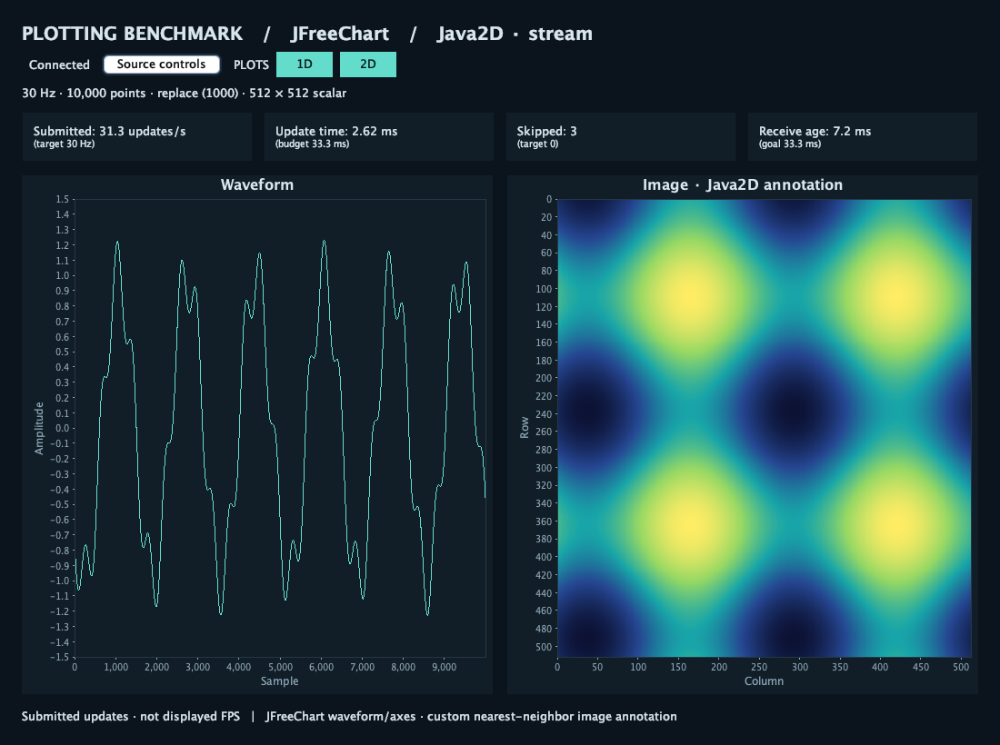

# JFreeChart / Java2D

An independent Java 17+ adapter using **JFreeChart 1.5.6**, the version used by
PShell. This measures the Plotbench adapter, not PShell application performance.
Visible runs support macOS and Linux Wayland desktops with XWayland. On Linux,
Swing renders through XWayland; doctor checks for the XWAYLAND server extension.
Record this as a distinct display protocol when comparing results.

The adapter consumes protocol v2, including multiple waveform plots, curves per
plot and scalar/RGB image plots. Plots use the shared grid and curve colours;
timings cover conversion and rasterization of every plot in the frame.

```sh
./scripts/setup rust jfreechart --dev
./scripts/plotbench doctor --frontends jfreechart
./scripts/plotbench demo jfreechart
./scripts/plotbench run --suite scenarios/jfreechart-smoke.json --dry-run
```

Setup uses `java`, `javac` and `jar` from PATH, or `PLOTBENCH_JAVA_HOME/bin`.
It verifies every dependency against `dependencies.lock.json` and compiles Java 17
bytecode. Maven is not needed. Runtime JARs remain separate in `build/lib`, with
their upstream license files. Replacing one requires rebuilding provenance before
measurement. Source and deployed JAR changes invalidate stale builds.



## Rendering and timing

The shared Rust or Python source supplies every frame. Replace and append modes
both replace the entire authoritative waveform window. JFreeChart's XY line
renderer draws all points as a path, with a one-physical-pixel opaque stroke, no
markers or decimation, fixed axes and antialiasing disabled. The one-point
degenerate x range uses [0,1] because JFreeChart requires a nonempty axis range.

The image is a custom Java2D annotation inside JFreeChart axes. Scalar data uses
the central 256-color table, fixed [0,1] levels and truncating LUT lookup; RGB bytes
are expanded to opaque ARGB. Nearest-neighbor sampling preserves row-zero-at-top
orientation. A reusable image holds only the adopted frame.

All conversion and chart mutation happens on Swing's event dispatch thread.
`conversion_ms` measures float32-to-double waveform copies and scalar/RGB-to-ARGB
image conversion. `draw_ms` measures synchronous JFreeChart rasterization and range
updates into a reusable physical-resolution BufferedImage per plot. `update_ms`
contains both stages. Buffer allocation on size changes is inside the timer.
Dataset/axis title layout is JFreeChart work, not a custom approximation.

Swing later blits the completed raster to the window. Blitting, compositor work
and presentation are outside these timers; submitted updates/s is not displayed
FPS. Java2D rasterization here targets a CPU BufferedImage. No GPU completion
signal is claimed. Text antialiasing remains enabled for readable axes.

Metadata records JDK/vendor/VM, compiler, library versions, JVM arguments, scale,
physical plot areas, display mode and receiver epochs. Select an explicit warmup
for JVM JIT compilation (e.g. 10–20 seconds), retain repetitions, and inspect
stability rather than assuming that a short run reached steady state.

## Transport and lifecycle

The Java HTTP/WebSocket client decodes off the EDT. An atomic latest-frame mailbox
and a coalesced EDT callback bound pending work. ACK follows strict decoding and
mailbox adoption; it does not claim rendering completion. Fragmented messages and
HTTP bodies are bounded. Reconnects reset sequence skip accounting and invalidate
comparison through receiver epoch metadata.

Replay preloads at most 16 central frames (server-capped at 256 MiB), cycles CPU
inputs with a separate monotonic presentation sequence, and repeats conversions
on every adopted update. It never preloads every frame into renderer resources.
There are no per-frame HTTP requests. Interactive 1D/2D controls request source
changes on a worker; replay explicitly reloads. Timed runs lock workload controls.

Duration starts after the first successful rasterization. Telemetry batches flush
approximately once per second and once more on exit, including an empty final
batch with termination reason and active duration. Export failures and sample
overflow invalidate results; all raw diagnostics remain in the campaign.

## Checks

```sh
.envs/plotting-benchmark/bin/python frontends/jfreechart/build.py --test
.envs/plotting-benchmark/bin/python -m plotbench.provenance jfreechart
```

JUnit also decodes packets produced by the shared Python encoder across 24
single/multiple-plot workloads and checks every rendered curve and converted image.
JUnit covers binary layouts, malformed packets, append windows, replay bounds and
pacing, fragmented ACK behavior, mailbox skips, conversion/raster correctness,
bounded HTTP bodies and final telemetry. Tests use headless Java2D and a local HTTP
server; they do not validate visible performance. CI checks JDK 17 and 25 on macOS
and Linux. See [validation](../../docs/validation.md) for observed desktop coverage.
