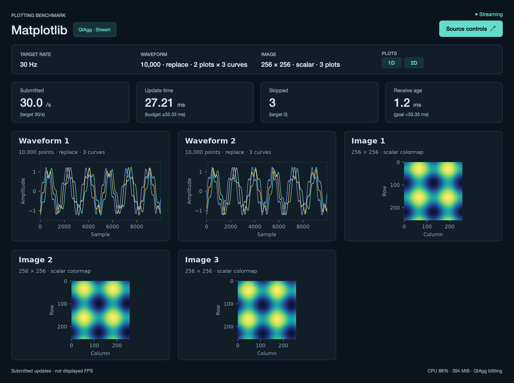

# Matplotlib adapter

Independent Python 3.13 environment using QtAgg, with reusable `Line2D` and
`AxesImage` artists and explicit background blitting.

From the repository root:

```sh
./scripts/setup rust matplotlib
./scripts/plotbench demo matplotlib
./scripts/plotbench demo matplotlib --mode replay
```

These commands use the default Rust source and require Rust/Cargo. For Python
input, install just `matplotlib` and use `./scripts/plotbench demo matplotlib --backend python`.

See [platform setup](../../docs/setup.md) for system requirements and
[validation](../../docs/validation.md) for test coverage.

Use the shared producer controls for source frequency/dimensions, waveform
replace/append, scalar/RGB images, waveform/image/both and the plot counts. Every
waveform update uses `set_data` on the full authoritative source window. Append mode
is a rolling source window, not a second client-side append buffer, so skipped
frames are safe.

## Plots, curves and layout (protocol v2)



The capture above is untimed visual QA of the 2 × 3-curve + 3-image smoke workload on macOS (2× pixel ratio).

The canvas holds one Matplotlib axes per waveform plot and one per image plot,
each inside its own card (rounded panel, heading, subtitle) drawn on the figure.
A waveform axes owns `curves` reusable `Line2D` artists; curve `c` is coloured with
`plotbench.palette.CURVE_COLORS[c % 8]` (curve 0 keeps the accent), and every curve
shares the same stroke width, no antialiasing, fixed x range `[0, points-1]` and
y range `[-1.5, 1.5]`. An image axes owns one `AxesImage` with the shared
colormap, `NoNorm`, nearest-neighbour interpolation and `interpolation_stage="rgba"`.
Each frame's `waveform` array `[waveform_plots, curves, points]` is sliced without
copying into per-curve `set_data` calls, and `image[p]` of the
`[image_plots, height, width(, 3)]` array feeds image plot `p`; the scalar-to-uint8
conversion runs once over all image plots and `conversion_ms` records that total.

The plot set (axes, cards and artists) is rebuilt only when the visible counts or
the curves per plot change, so the artists survive ordinary configuration changes
(points, size, mode). Visible plots are ordered waveform plots first, then image
plots, and placed on the shared grid `columns = ceil(sqrt(n))`,
`rows = ceil(n / columns)`, filled row-major with equal cells (`n=2` keeps the
side-by-side split, `n=3..4` gives 2×2, `n=5..6` gives 3×2, `n=9` gives 3×3);
the 16-pixel gaps and card margins are applied per cell. Titles are `Waveform` /
`Image` for one plot of a kind, otherwise `Waveform 1`, `Waveform 2`, … and
`Image 1`, …; waveform subtitles add `· K curves` when `curves > 1`, and the
summary strip shows `10,000 · replace · 2 plots × 3 curves` / `… · 3 plots`.

Blitting is unchanged in principle but covers every plot: one cached background
holds all axes and cards, and each frame restores it, draws every animated artist
(all curves of all waveform plots, then every image) and blits the whole figure
once. `update_ms` therefore times the complete frame across all plots and curves.
Metadata records `plot_counts: {"waveform": N, "image": M}` (0 for a kind hidden
by `view`), `curves: K`, and `plot_viewports` as the physical data area of the
first plot of each kind (all cells are equal).

The baseline disables Matplotlib path simplification and Agg path chunking, uses
one physical pixel strokes without antialiasing, fixed axes, nearest-neighbor
image interpolation, and the shared 256-entry colormap with fixed [0,1] scalar
levels. RGB arrays are passed directly to `AxesImage.set_data`. No data decimation
is performed. Resizing or changing source configuration invalidates the static
background; normal updates restore it and draw only changing artists.

Scalar inputs are converted to uint8 indices with exactly
`floor(clamp(value,0,1)*255)` inside the timed update. `NoNorm` passes those indices
to the native `ListedColormap`/`AxesImage` scalar path. Matplotlib's default float
normalization uses 256 bins and would otherwise differ from the shared source
mapping. The adapter does not construct a full RGB image; native Matplotlib color
lookup remains in the draw path. `conversion_ms` records index conversion alone.
`interpolation_stage="rgba"` fixes the color-mapping stage at source resolution.
The installed Matplotlib 3.11 default `auto` also selects this stage when either
display scale is below 3, including downsampled large images. Native image
conversion and resampling overhead remains part of the measured Matplotlib path.

The HUD counts successful **submitted updates**, not display refreshes.
`update_ms` includes artist setters, scalar color mapping, synchronous Agg
rasterization and QtAgg `canvas.blit`. It excludes operating-system compositor
presentation. This timing covers more work than an asynchronous library's setter
submission time; the report must preserve the measurement-stage label instead of
ranking their setter durations as equivalent rendering costs. Receive age is only
an approximate same-host wall-clock estimate and is absent in replay.

Metadata includes NumPy and Qt versions, current window/screen geometry, screen
name/model, reported refresh rate, device scaling, and renderer environment
overrides. These values refresh at the 2 Hz HUD cadence, including screen changes.
`display.refresh_hz` is Qt's reported nominal rate, not measured presentation
frequency. Physical image dimensions use the aspect-adjusted axes bounding box.

Offscreen smoke tests verify source integration and the software draw path; real
visible windows are required for comparable desktop benchmark runs.

Tests: `QT_QPA_PLATFORM=offscreen .envs/plotting-benchmark-matplotlib/bin/python -m pytest frontends/matplotlib/tests`.
`--duration` starts after the first successful submission and excludes replay preload.

Official reference: [Matplotlib blitting](https://matplotlib.org/stable/users/explain/animations/blitting.html).

Metric cards show parenthesized targets from the **active input frames**: submitted
updates target the configured rate, update time has a one-period budget
(`1000 / Hz` ms), skipped frames target zero, and receive age has an indicative
goal below one period. These guides are not displayed-FPS measurements or latency
guarantees; the update budget excludes deferred GPU and display presentation work.
Replay shows receive age as **N/A**. Targets remain unavailable before the first
frame and follow the active rate after stream changes or replay reloads. Hover over
a metric card for the interpretation.
