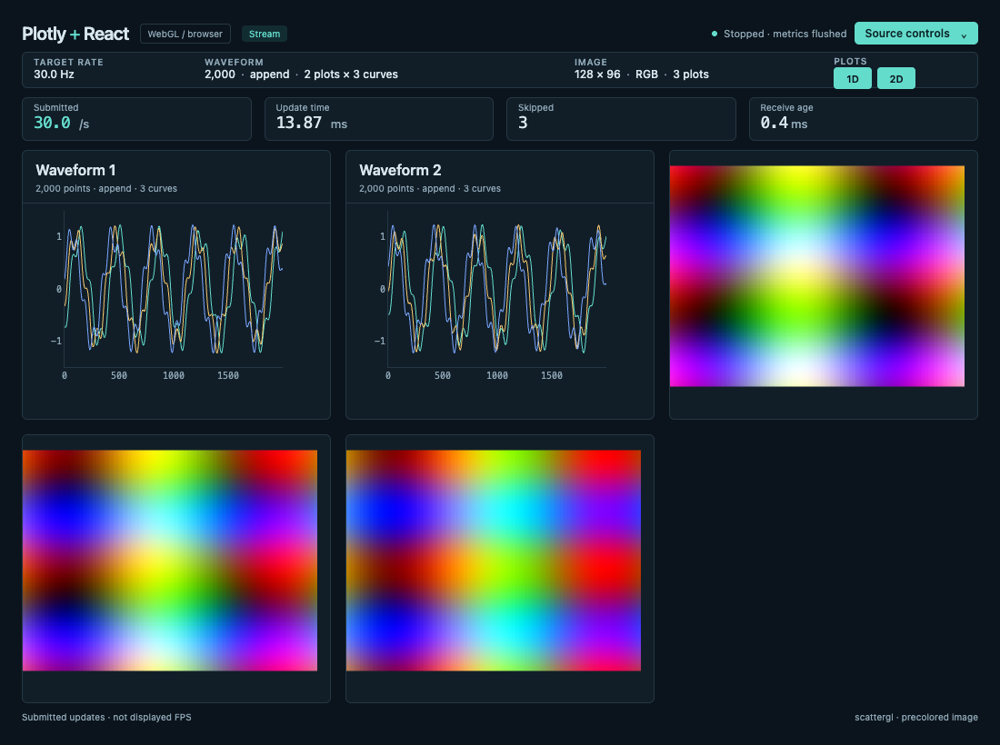

# React + Plotly frontend

An independent TypeScript/React application for the shared Plotbench source. It contains no data
generator and has its own exact npm dependency lock. No Python, Qt, or Rust packages are installed
in this frontend.

## Run

From the repository root, install Rust/Cargo and npm, then build the default
source and browser frontend:

```sh
./scripts/setup rust plotly
./scripts/plotbench demo plotly
```

For Python input, install just `plotly` and select
`./scripts/plotbench demo plotly --backend python`;
this does not require Rust/Cargo. See [platform setup](../../docs/setup.md) for
browser prerequisites and explicit browser selection.

For a direct browser launch, use Node/npm compatible with
[`package.json`](package.json); [`.node-version`](../../.node-version) records the
repository's tested Node version. Start the shared source in another terminal
(`serve` defaults to Rust; use `serve --backend python` for Python), then run from
the repository root. The provenance command needs the core installed by setup:

```sh
npm ci --prefix frontends/plotly --cache "$PWD/.cache/npm" --no-audit --no-fund
npm --prefix frontends/plotly test
npm --prefix frontends/plotly run build
.envs/plotting-benchmark/bin/python -m plotbench.provenance plotly
npm --prefix frontends/plotly run preview
```

Open [the preview](http://127.0.0.1:4173/). Use
`npm --prefix frontends/plotly run dev` at port 5173 for development; benchmark
the production build to exclude development-server instrumentation. Vite binds only to localhost.
The default source address is `http://127.0.0.1:8765`; the core must allow this origin through CORS.

The application supports these query parameters:

| Parameter | Default | Meaning |
| --- | --- | --- |
| `url` | `http://127.0.0.1:8765` | Shared source base URL |
| `mode` | `stream` | `stream` or centrally preloaded `replay` |
| `run_id` | `demo` | Identifier attached to uploaded measurements |
| `duration` | `0` | Seconds after the first successful update; zero runs until stopped |
| `width` | `1100` | Requested logical application width |
| `height` | `820` | Requested logical application height |

For example:

```text
http://127.0.0.1:4173/?mode=replay&run_id=plotly-replay&duration=35&width=1100&height=820
```

Set the browser viewport to the requested dimensions in automation. Query parameters cannot resize
the browser itself. The actual viewport, device pixel ratio and individual plot sizes are recorded
in metadata. `plot_viewports` contains physical data-area dimensions excluding axes and margins;
`plot_viewports_logical` records those lengths in CSS pixels and `plot_containers` separately records
the outer chart boxes. All three describe the **first** plot of each kind (every grid cell has the
same size); `plot_counts: {waveform, image}` records the visible widget counts (0 for a kind hidden
by `view`) and `curves` the curves per waveform plot. Hidden plots are null. Data areas use Plotly 4's resolved axis lengths,
including aspect-ratio domain constraints; unavailable diagnostics remain null rather than guessed.
`render_contract` identifies `data-area-v2`; `plot_viewports_all` independently records
every visible plot's data area, and reports reject mismatched or undersized geometry.
Keep the window visible and foreground during comparative performance measurements;
headless runs are useful for functional smoke tests.

The header's **Source controls** drawer is collapsed initially to leave the plots visible. It
contains the workload form, input-mode selector, a link to the common source page and `Stop & save`.
The compact workload strip and four metric cards remain visible. The layout follows the browser
viewport and supports 860 × 640 through the default 1100 × 820 without hiding controls or metric
values.

## Plot layout (protocol v2)

The source configuration carries `waveform_plots` (1–16), `curves` per waveform plot (1–64) and
`image_plots` (1–16). The page shows one card per plot: waveform plots first (`Waveform 1..N`), then
image plots. Single-plot cards use the titles `Waveform` / `Image`. Waveform subtitles
show `points · mode` (plus `· K curves` above one curve); single-image subtitles show
`width × height · mode`. Multi-plot image cards hide headings and axes to preserve the
shared data-area layout. The visible
plots (`n = N + M`, counting only the kinds enabled by `view`) fill a CSS grid with
`columns = ceil(sqrt(n))` equal-width columns (`repeat(columns, minmax(0, 1fr))`) and
`ceil(n / columns)` equal-height rows, row-major, trailing cells empty: 1 → 1×1, 2 → side by side,
3–4 → 2×2, 5–6 → 3×2, 9 → 3×3, up to 6×6 for 16 + 16. `gridColumns` in
[`src/plot-grid.ts`](src/plot-grid.ts) is the pure rule; the `.plots` section receives the column
template as an inline style. Visible card headings truncate with an ellipsis rather than growing.
The geometry contract rejects dense grids whose slots fall below 32 logical pixels;
such workloads need a larger viewport.

Every curve `c` of every waveform plot is a separate `scattergl` trace coloured with the shared
palette `CURVE_COLORS[c % 8]` (`#64dccc`, `#f5c76e`, `#7aa6ff`, `#ff9d7a`, `#c39bff`, `#9be564`,
`#ff7ab8`, `#6ee7ff`); curve 0 keeps the accent colour. All curves of a plot share the fixed
`[-1.5, 1.5]` / `[0, points-1]` axes, the one-physical-pixel stroke, no markers and no decimation.
The workload strip shows `2,000 · replace · 2 plots × 3 curves` when plots or curves exceed one and
`128 × 96 · scalar · 3 plots` for several image plots.

The adapter owns the per-plot DOM: React renders the two kind containers, and
[`PlotAdapter`](src/adapter.ts) creates one `<article>` (heading plus Plotly `<div>`) per waveform
plot and per image plot from the frame configuration, purging (`Plotly.purge`) and removing cards
when counts shrink. The widget set is therefore rebuilt synchronously with the first frame of a new
generation and cannot lag behind a React render.



The capture above is post-completion visual QA of the 2 × 3-curve + 3-image smoke workload on macOS (1× pixel ratio, 1100×820 viewport).

**Cost:** each plot is its own Plotly figure, so one frame costs `waveform_plots + image_plots`
`Plotly.react` calls (N + M per frame), each with a full relayout; `update_ms` covers all of them,
`conversion_ms` covers every image plot's RGBA mapping and PNG encoding, and `update_complete_ms`
waits for all N + M returned Promises. Curves add traces to a figure, not figures; each image reads
its full block of the plot-major payload directly into a reusable RGBA buffer.

The controls change the **shared source** through `POST /api/config`, including frequency, point
count, append size, curves per plot, waveform and image plot counts, image dimensions and scalar/RGB
mode. The workload strip's **1D** and **2D** buttons select waveform, image or both by changing the
source's `view` alone. Turning a plot kind off removes its array from source packets and its cards
from the grid, which re-flows for the remaining plots. At least
one plot stays enabled; enable the other first to switch between single plots. Buttons are disabled
until configuration arrives, while a request is pending, after stopping and during duration-limited
recorded runs. A failed request preserves the confirmed selection, shows an error and permits retry.
The drawer submits only fields edited by the user, so stale forms cannot restore an old view or
other settings changed elsewhere. Confirmed updates refresh pristine fields while preserving unsaved
edits, including edits made while a request is pending. Failed requests retain those edits for retry.

These controls update the shared source for other connected stream demos. Stream demos also follow
configuration changes made by another frontend or the source page. Replay holds its bounded CPU
sequence until this frontend's own controls fetch a replacement; external changes do not alter an
already-preloaded replay. Its 1D/2D buttons reload that sequence too. The old sequence keeps playing
until a replacement is downloaded and validated. If that preload fails, the old replay and selected
buttons remain intact and permit retry; the shared source may already have accepted the new view.
Choosing a different input mode reloads the page.

## What is measured

React owns the controls and a HUD refreshed twice per second. Plotly owns the actual plot DOM.
Frame arrays stay outside React state. A scheduler keeps one active asynchronous Plotly update and
one replaceable pending frame. It never deliberately queues a growing history of plot operations.
After decoding and offering each WebSocket packet, the client immediately sends
`{"ack": sequence, "generation": generation}` before deferred plotting begins. The source permits
one packet in flight per client and sends the newest available frame after that acknowledgment,
bounding browser transport/event buffering as well as the application mailbox. Every received
packet is acknowledged, including a superseded configuration generation. An acknowledgment returns
transport credit; it does not claim that a frame was drawn. Streaming still includes transport costs.

HUD state updates, React reconciliation and their browser layout/paint work run outside the explicit
`update_ms` boundary. They still compete for the same main thread and affect achieved throughput and
process CPU. Plot geometry reads and any consequent synchronous layout during an adapter call are
included in `conversion_ms`. This demo measures the adapter in a live GUI, with that bounded HUD
overhead retained and disclosed; it is not a detached plotting microbenchmark.

| Workload | Implementation |
| --- | --- |
| Waveform replace | One `scattergl` trace per curve (subarray views of the `[plots, curves, points]` payload), full authoritative float32 window supplied to one `Plotly.react` per waveform plot |
| Waveform append | Same full-window submission, displaying the source's rolling window |
| Scalar image | Direct lookup through the shared 256-color palette into RGBA, full-resolution PNG supplied to one Plotly `image.source` trace per image plot |
| RGB image | Interleaved RGB expanded directly into opaque RGBA, full-resolution PNG supplied to one Plotly `image.source` trace per image plot |

Append is a data-semantics comparison here: **this adapter does not use `extendTraces`**. Full
replacement preserves fixed sample indices and recovers immediately after dropped frames. It does
not represent the best possible performance of a separately optimized incremental Plotly adapter.
Waveforms use no point markers or decimation, fixed axes and a one-physical-pixel line. Images use
nearest-neighbor interpolation (`zsmooth: false`) and an equal spatial aspect ratio. Scalar values
are clamped to `[0, 1]` and use the core's discrete `floor(value * 255)` lookup (NaN maps to zero).

The adapter caches a packed 256-color RGBA palette and one canvas, context and `ImageData` buffer per
image plot. It resizes the buffer when dimensions change and releases it when the plot is removed.
Every adopted frame still converts every source pixel, calls `putImageData` and encodes a fresh
full-resolution PNG data URI, including repeated replay frames. There is no rendered-frame cache
or decimation. Plotly's public `image.source` API consumes this URI and performs its own image
loading and internal canvas work. This avoids its native heatmap's general color mapping and the
RGB `z` path's nested pixel arrays, but retains PNG encoding/decoding costs. Fyne uses the same
palette lookup without the browser PNG stage. Metadata identifies the precolored image path so
results remain distinguishable from the earlier native heatmap/RGB `z` implementation.

* `update_ms`: monotonic elapsed time for conversion and the synchronous `Plotly.react` calls of
  every plot in the frame.
* `conversion_ms`: preparing traces for all plots and curves, full-resolution RGBA conversion,
  `putImageData` and PNG encoding of every image plot, layouts, visibility and the widget-set
  rebuild on a configuration change. Scratch buffer allocation on first use or resize is included.
* `draw_ms`: synchronous Plotly update calls; already included in `update_ms` and excludes waiting
  for their returned Promises. Adding it to `update_ms` would count that work twice.
* `update_complete_ms`: elapsed time from adapter-call start through successful completion of all
  active Plotly Promises (one per plot). Includes conversion, synchronous calls, deferred library
  work and wait, including Plotly's image loading and internal canvas work after submission.
  This is not GPU time, screen presentation time, or a measurement of CPU execution alone.
* Submitted updates: increments after every active Plotly Promise resolves successfully. Calls are
  serialized until that point. Promise resolution is not a GPU fence or proof of screen presentation.
* Skipped updates: source sequence gaps between submitted frames, reset when configuration changes.
* Approximate receive age: local wall-clock time at update start minus source emission time. Negative
  estimates are retained. This is null for replay and is not presentation latency.

Each metric card has a live hint: the source rate for Submitted, one source period (`1000 / Hz` ms)
as the Update time budget and Receive age freshness goal, and zero for Skipped. Replay receive age
is marked N/A. These are practical throughput and freshness heuristics; staying below the source
period does not prove GPU completion or screen presentation.

The HUD therefore says **submitted updates/s**, not displayed FPS. Replay preloads at most the
server's 256 MiB cap and cycles changing CPU arrays at the source target rate; it does not preload
GPU frames. Timer delays advance directly to the newest replay tick. Metadata records the actual
`replay_frames` and `replay_bytes`, and the finite cache-warm nature of this mode.

Metrics are batched approximately once per second. An upload failure is visible, retried, and uses
a bounded 512-sample buffer; evicted samples are counted explicitly. `Stop & save` waits for the
active plot update and final metrics upload. A duration-limited run sets
`window.__plotbenchStatus.complete = true` and `running = false` **after** that final flush. Automation
must also verify `error === null`, `submitted > 0`, and `stop_reason === 'duration'` for scheduled
runs. The other stop reasons are `user`, `error` and `dispose`. Closing a tab abruptly cannot guarantee a final
network upload; use the stop button or duration for recorded runs.

The browser worker exposes `window.__plotbenchLifecycle` before loading the page. The engine calls
it after its first successfully recorded submission and after stopping and flushing metrics. There
is no repeated CDP status evaluation during measurement. Early window closure, page errors,
missing startup/completion signals, telemetry errors and premature stops fail a recorded run.
An untimed demo remains open across Stop/Restart and exits when its window closes. A requested
`--screenshot` requires a positive `--duration` and is captured only after timed completion and
the final frontend telemetry flush; preview work is outside the measurement window. Final worker
metadata records whether capture was requested and succeeded. Metadata is exported at shutdown
even if the periodic upload already drained all samples.

The shared browser launcher disables network instrumentation on Playwright's original Chromium
session before loading the frontend. This prevents unused WebSocket payload copies through the
automation transport. Plotly and Fyne WASM use the same launcher; lifecycle bindings, error
notifications and post-completion screenshots remain available. Metadata records
`browser_network_instrumentation: "disabled"`, and reports group it separately from earlier runs
with monitoring enabled or unrecorded. The controller uses Playwright's bundled Node runtime
and fails explicitly if the installed Playwright cannot disable monitoring on its original session.

Before streaming or replay preload, `browser_context` records the browser-reported screen,
available screen area, window position/dimensions, DPR, focus/visibility, cross-origin isolation,
secure-context state and a bounded sample of `performance.now()` increments. The minimum positive
observed increment may be null and is not a guaranteed timer resolution. Screen/window values may
reflect browser emulation. Actual refresh rate remains unavailable: record the controlled display
configuration separately. Existing per-update viewport and plot-area metadata track actual layout.
WebSocket parsing/acknowledgment occurs on the page main thread, before deferred plotting starts.
Resource measurements cover the worker and its descendants, including Playwright and Chromium's
GPU process. GPU-process CPU is not GPU utilization; WindowServer and the source are outside this
process tree.

## Validation

`npm --prefix frontends/plotly test` covers protocol v2 packet alignment, byte bounds,
three-/four-dimensional descriptors and their exact configuration shapes, plot-major curve and
image slices, rejection of version 1 and wrong shapes, the `curves` / `waveform_plots` /
`image_plots` limits, the grid layout rule, titles, subtitles, strip suffixes and the curve palette,
replay containers, bounded scheduling,
asynchronous-update serialization and completion timing, skipped-frame accounting, bounded clock
observation and metrics retry/drop/final-metadata behavior. Tests also cover the complete
plot-selection transition matrix, the final-enabled-plot guard,
configuration/pending/recorded-run locks, confirmed selection after a failed request, sparse
configuration patches, active-edit preservation, edits during requests and dynamic metric hints.
Raster tests verify exact scalar/RGB bytes, boundary values, plot-major offsets, buffer reuse with
changing frames, dimension changes, cleanup and PNG encoding on every call, including failures.
`npm --prefix frontends/plotly run build` runs strict TypeScript checking and creates
the production bundle. Vite empties `dist/` first, so after every build the provenance
must be re-recorded with `.envs/plotting-benchmark/bin/python -m plotbench.provenance plotly`
(or by running `./scripts/setup plotly`, which builds and records in one step); otherwise the
core rejects the artifact as stale.
Core `tests/test_browser_worker.py` and `tests/test_browser_controller.py` check lifecycle
completion, failure/timeout handling, launcher selection and post-completion capture order without
opening a browser. `core/tests/browser_driver.test.cjs` verifies original-session network monitoring
is disabled before navigation, lifecycle/error notifications, and controller cleanup.

Functional Chrome smoke tests exercised scalar and RGB images, replace and append windows, both
transport modes, all three views, configuration updates and automatic final metrics flushing.
Headless protocol v2 checks ran 2 waveform plots × 3 curves plus 3 scalar image plots (3×2 grid)
in stream and replay mode, 4 plots × 9 curves plus 6 RGB image plots (4 columns × 3 rows, replay)
and a single image-plot view (stream), verifying exit status, `plot_counts` metadata and the
rendered grid. Headless smoke measurements are not performance rankings.

Visible Chrome presentation checks used a private source and native device pixel ratio 2. They
verified the collapsed drawer, open/apply/stop actions, both equal-width cards, each single view,
live resize from 1100 × 820 to 860 × 640, RGB/replay switching, the replay receive-age dash and
updated physical viewport metadata. The plot-selection checks also inspect actual WebSocket and HTTP packet descriptors after each
view change, verify that disabled arrays are omitted, exercise replay reloads, and check pending
requests, an injected config failure with retry, a stale drawer submission and a recorded-run lock.
A focused headless check also verifies continued playback after a failed replay download and during
a delayed retry, followed by the correct new selection and a successful final metrics flush.
Further visible checks combine the shared source form with Plotly: an external 1D selection remains
active after rate and resolution edits, unedited values refresh, active and in-flight edits survive,
and captured requests contain only changed keys. Dynamic hints follow 120 Hz and replay shows N/A.
Layout checks verify the 64-pixel workload strip and four 88-pixel metric cards at 860 × 640, without
clipped hints, page overflow or JavaScript errors.


[Source controls drawer](screenshots/plotly-controls.png) ·
[860 × 640 layout](screenshots/plotly-compact.png)

## API references

* [Plotly update functions](https://plotly.com/javascript/plotlyjs-function-reference/)
* [Scattergl trace, including linear x coordinates](https://plotly.com/javascript/reference/scattergl/)
* [Image trace and encoded source](https://plotly.com/javascript/reference/image/)

The distributed Plotly bundle currently uses separate DefinitelyTyped declarations. The adapter
contains narrow assertions for documented runtime properties (`version` and linear coordinate
parameters) missing from those declarations; strict application types
and the browser smoke tests cover their usage.
