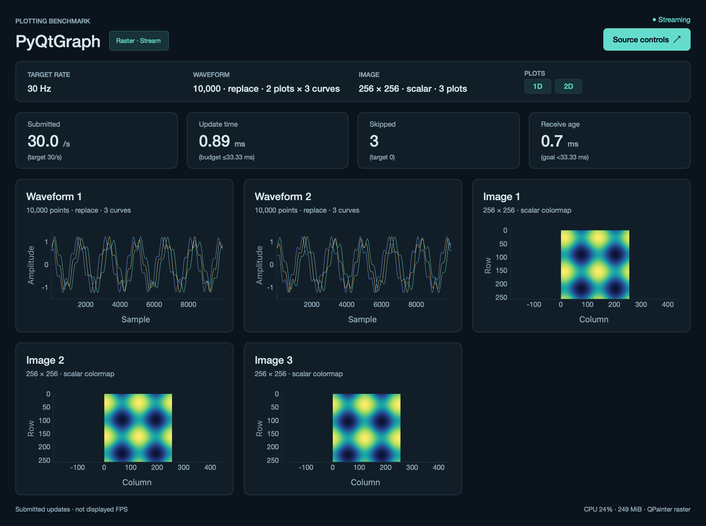

# PyQtGraph adapter

Independent Python 3.13 package. Only this adapter's environment contains PyQtGraph;
the source/telemetry client comes from the sibling `core` package.

From the repository root:

```sh
./scripts/setup rust pyqtgraph
./scripts/plotbench demo pyqtgraph
./scripts/plotbench demo pyqtgraph --mode replay
```

These commands use the default Rust source and require Rust/Cargo. For Python
input, install just `pyqtgraph` and use `./scripts/plotbench demo pyqtgraph --backend python`.

See [platform setup](../../docs/setup.md) for system requirements and
[validation](../../docs/validation.md) for test coverage.


The producer control page changes frequency, dimensions, waveform replace/append,
RGB/scalar image, waveform/image/both views, and the plot layout (`waveform_plots`
× `curves` waveform plots, `image_plots` image plots; protocol v2). All updates use
the complete authoritative rolling window with `PlotDataItem.setData`; append is a
source semantic, not an incremental PyQtGraph operation. Dropping intermediate
frames therefore cannot corrupt the visible window.

## Plots, curves and layout



The capture above is untimed visual QA of the 2 × 3-curve + 3-image smoke workload on macOS (2× pixel ratio).

The adapter creates one `PlotCard` + `pg.PlotWidget` per waveform plot, holding
`curves` `PlotDataItem`s, and one per image plot, holding a single `ImageItem`.
The widget set is rebuilt when a frame's generation changes the counts or the
view: widgets whose index survives are reused (their items keep their settings),
missing ones are created and surplus ones are removed from the grid and
`deleteLater`'d. Per frame the adapter submits exactly one
`PlotDataItem.setData(x, waveform[p, c])` per curve of every waveform plot and one
`ImageItem.setImage(image[p])` per image plot; `waveform[p, c]` and `image[p]` are
NumPy views of the decoded `[waveform_plots, curves, points]` /
`[image_plots, height, width(, 3)]` arrays, never copies. `update_ms` covers the
whole frame (all plots and curves, including a configuration change);
`conversion_ms` sums the scalar-to-uint8 conversions of every image plot.

Layout follows the shared rule: visible plots are ordered waveform plots first,
then image plots, `n` counting only the kinds enabled by `view`, on a `QGridLayout`
with `columns = ceil(sqrt(n))`, `rows = ceil(n / columns)`, filled row-major with
equal column/row stretch; trailing cells stay empty (1 → 1×1, 2 → 2×1, 3–4 → 2×2,
5–6 → 3×2, 9 → 3×3; `dashboard.grid_shape`). Titles are `Waveform` / `Image` for a
single plot of a kind, otherwise `Waveform 1`, `Waveform 2`, … / `Image 1`, …;
subtitles add `· K curves` when `curves > 1`, and the workload strip shows
`· 2 plots × 3 curves` / `· 3 plots` when a count exceeds one. Curve `c` of every
waveform plot uses `plotbench.palette.CURVE_COLORS[c % 8]` (curve 0 keeps the
accent colour) with the same cosmetic width-1 pen, no antialiasing, no
downsampling, no clip-to-view and no dynamic-range limit as before; all curves of
a plot share the fixed x range `[0, points-1]` and y range `[-1.5, 1.5]`.

Baseline: no downsampling, clipping optimization, or antialiasing; opaque cosmetic
one-physical-pixel curve, fixed y limits, row-major image, nearest-neighbor display
and the shared 256-entry LUT with fixed [0,1] scalar levels. The cosmetic width-1
pen remains one physical pixel at DPR 2. Source data is finite by construction.
`skipFiniteCheck=True` and `setDynamicRangeLimit(None)` disable explicit curve
finite validation and the default dynamic-range finite/bounds scan. This does not
remove every internal bounds calculation from PyQtGraph's painting machinery.
Axes are fixed until the source configuration changes.

Scalar inputs are converted to uint8 indices with exactly
`floor(clamp(value,0,1)*255)` inside the timed adapter update. ImageItem then uses
its native indexed-LUT path with `levels=None`, preserving those indices. This
step is necessary because its default float LUT scaling uses 256 bins and would
select a different color at values such as 0.5. No full RGB array is generated by
the adapter. `conversion_ms` records index conversion separately.

`--opengl` enables `useOpenGL`. That is PyQtGraph's global option: every
`PlotWidget` the adapter builds (also those created later on a layout change)
reads it in `GraphicsView.__init__` and gets its own `QOpenGLWidget` viewport. In
the pinned **PyQtGraph 0.14** implementation, `PlotCurveItem` automatically uses
its OpenGL shader path on that viewport, via Qt's OpenGL classes. The older `enableExperimental` gate is no longer required
for curve drawing; it stays **false in both variants**. A 3.3 core context is
requested (macOS may negotiate a higher supported version). Images remain
`ImageItem` CPU LUT/QImage rendering painted onto the OpenGL viewport; this is not
a custom GPU scalar shader. Exact flags, context version, and curve shader readiness
are recorded in metrics. PyOpenGL is not required by this 0.14 code path.

The HUD's submitted updates/s counts successful data submissions, **not displayed
FPS**. `update_ms` times scalar index conversion and `setData`/`setImage`, including
configuration changes but excluding deferred Indexed8 QImage/color-table
preparation, QPainter's per-pixel LUT expansion/painting, and GPU work. Calling
`ImageItem.render()` alone would prepare the indexed image without timing the
per-pixel color lookup performed during painting. Compare `update_ms` only
with metrics at the same measurement stage. Stream receive age is an approximate
same-host wall-clock estimate; replay has no receive-age metric. Reception runs in
the shared latest-frame mailbox so slow rendering skips stale frames with a count.

Metadata includes NumPy and Qt versions, the window's current screen name/model,
reported refresh rate, screen/window geometry, device scaling, and renderer
environment overrides. It refreshes with the HUD (2 Hz), so moving the window to
another display is recorded. `display.refresh_hz` is Qt's reported nominal rate,
not measured presentation frequency; unset environment overrides do not identify
Qt's resolved render loop. Physical plot areas continue to describe actual data
drawing areas after image aspect fitting, excluding axes and letterboxing;
`plot_viewports` describes the first plot of each kind (all grid cells are equal),
`plot_counts` records the visible waveform/image widget counts (0 for a kind
hidden by `view`) and `curves` the curves per waveform plot. The OpenGL context
metadata is read from the first waveform plot's viewport.

CPU/offscreen smoke tests are useful for lifecycle and data correctness. The OpenGL
variant deliberately rejects `QT_QPA_PLATFORM=offscreen`: it must be tested with a
real graphical desktop and must not be reported as a GPU benchmark after a fallback.
On macOS, `QWidget.grab` and `QOpenGLWidget.grabFramebuffer` can reset/omit a
QGraphicsView GL viewport; visual QA exports the bound framebuffer immediately
after the actual scene paint instead. This verifies library drawing without
claiming operating-system compositor presentation. The two retained
`pyqtgraph-gl-*` PNGs document the initial renderer check before the presentation
refresh; the current raster screenshot shows the shell shared by both variants.

Tests: `QT_QPA_PLATFORM=offscreen .envs/plotting-benchmark-pyqtgraph/bin/python -m pytest frontends/pyqtgraph/tests`.
`--duration` starts after the first successful submission and excludes replay preload.

Official references: [PyQtGraph configuration](https://pyqtgraph.readthedocs.io/en/latest/api_reference/config_options.html),
[ImageItem](https://pyqtgraph.readthedocs.io/en/latest/api_reference/graphicsItems/imageitem.html).

Metric cards show parenthesized targets from the **active input frames**: submitted
updates target the configured rate, update time has a one-period budget
(`1000 / Hz` ms), skipped frames target zero, and receive age has an indicative
goal below one period. These guides are not displayed-FPS measurements or latency
guarantees; the update budget excludes deferred GPU and display presentation work.
Replay shows receive age as **N/A**. Targets remain unavailable before the first
frame and follow the active rate after stream changes or replay reloads. Hover over
a metric card for the interpretation.
