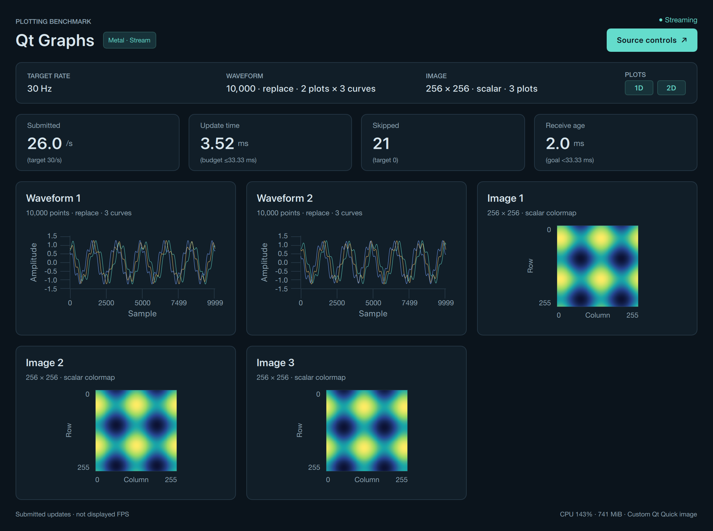

# Qt Graphs and custom Qt Quick image adapter

Independent Python 3.13 + PySide6 environment. Waveforms use **Qt Graphs** QML
`GraphsView`/`LineSeries`, bulk-updated with `QLineSeries.replaceNp`. This does not
use the deprecated Qt Charts module. qtpy supplies ordinary Qt types; QtGraphs is
imported from PySide6 because qtpy does not wrap this module. One window holds
`waveform_plots` Qt Graphs views (each with `curves` line series) and `image_plots`
custom Qt Quick images, as described under
[multiple plots and curves](#multiple-plots-and-curves-protocol-v2).

From the repository root:

```sh
./scripts/setup rust qtgraphs
./scripts/plotbench demo qtgraphs
./scripts/plotbench demo qtgraphs --mode replay
```

These commands use the default Rust source and require Rust/Cargo. For Python
input, install just `qtgraphs` and use `./scripts/plotbench demo qtgraphs --backend python`.

See [platform setup](../../docs/setup.md) for system requirements and
[validation](../../docs/validation.md) for test coverage.


**The image view requires additional custom work.** Qt Graphs does not provide a
native 2D scalar/RGB image series. This adapter implements a `QQuickImageProvider`,
owns a detached RGB `QImage`, maps scalar arrays through the common LUT on the CPU,
invalidates the QML image source for every frame, and supplies image axes/layout.
Qt Quick then uploads/displays the image texture. The UI, metadata, and report
label this as custom Qt Quick image rendering; do not attribute that capability
to a built-in Qt Graphs image plot. Native color-bar, pixel picking and scientific
image tools would need more custom work and are outside this benchmark.

## Multiple plots and curves (protocol v2)



The capture above is untimed visual QA of the 2 × 3-curve + 3-image smoke workload on macOS (2× pixel ratio).

Frames arrive as `waveform[waveform_plots, curves, points]` and
`image[image_plots, height, width(, 3)]`. Per frame the adapter calls
`replaceNp(x, waveform[p, c])` on every series (zero-copy NumPy row views), converts
every image plot through `FrameImageProvider.update_image(p, image[p])` and then
publishes one URL per image plot, `image://frames/<plot>/<generation>/<seq>`;
`requestImage` parses the plot index from the id and the generation/sequence part only
defeats Qt Quick's image cache. `update_ms` covers the whole frame (all plots, all
curves, all images); `conversion_ms` sums the scalar LUT/RGB `QImage` ownership copies
of all image plots.

**Dynamic construction.** `Main.qml` lays the plots out in one `GridLayout`
(`objectName: "plotGrid"`) fed by two `Repeater`s over `benchmark.waveformPlots` and
`benchmark.imagePlots` (the configured counts, or 0 for a kind hidden by `view`).
Each waveform panel holds a `GraphsView` (`waveformGraph-<p>`); each image panel an
`Image` (`streamImage-<p>`). `LineSeries` is not a Qt Quick `Item`, so a `Repeater`
cannot instantiate it and the `GraphsView` default `seriesList` property cannot hold a
`Repeater`; instead an `Instantiator` with `model: benchmark.curves` creates one
`LineSeries` per curve (`waveformSeries-<p>-<c>`) and registers it with
`graph.addSeries` / `graph.removeSeries`. Delegates are created synchronously while
the controller emits `configChanged`, so after every generation change the
controller re-resolves the `[plot][curve]` series matrix and the first graph/image by
`objectName`. Repeater delegates have no `QObject` parent (the delegate model owns
them), so `named_objects()` walks `QObject.children()` *and* `QQuickItem.childItems()`
rather than relying on `findChild`. A missing series or first plot raises immediately
and ends the run; the adapter never silently draws fewer curves.

**Layout rule (shared).** Visible plots are ordered waveform plots first, then image
plots, `n` counting only the kinds enabled by `view`; the grid uses
`columns = ceil(sqrt(n))`, rows follow, cells are filled row-major with equal sizes
(`Layout.preferredWidth/Height: 1` + fill), and trailing cells stay empty
(n=1 → 1×1, 2 → 2×1, 3–4 → 2×2, 5–6 → 3×2, 9 → 3×3). Titles are `Waveform` /
`Image` for a single plot of that kind and `Waveform 1`, `Image 2`, … otherwise;
subtitles add `· K curves` when `curves > 1`. The summary strip shows
`10,000 · replace · 2 plots × 3 curves` and `512 × 512 · scalar · 3 plots` when the
counts exceed 1.

**Palette.** Curve `c` uses `plotbench.palette.CURVE_COLORS[c % 8]`
(`#64dccc`, `#f5c76e`, `#7aa6ff`, `#ff9d7a`, `#c39bff`, `#9be564`, `#ff7ab8`,
`#6ee7ff`), exposed to QML as `benchmark.curveColors`; curve 0 keeps the accent colour.
All curves of a plot share the fixed ranges x=[0, points-1], y=[-1.5, 1.5], the
one-physical-pixel stroke and no antialiasing, markers or decimation.

**Metadata.** `plot_viewports` reports the physical plot area of `waveformGraph-0`
and the painted rectangle of `streamImage-0` (all cells are equal), `plot_counts`
the visible widget counts (0 for a hidden kind) and `curves` the curves per plot.
The per-plot cost is one `replaceNp` per series and one `QImage` copy plus a
synchronous provider request per image; Qt Graphs draws every `GraphsView` in the
shared scene graph.

Replace and append both bulk-replace the complete authoritative rolling window.
No Python `QPointF` objects are allocated per point and no hidden decimation is
performed. Lines are one physical pixel wide; axes use fixed limits, image display
uses nearest-neighbor interpolation, and scalar color limits remain [0,1]. The
source controls select waveform/image/both and scalar/RGB workloads.

`update_ms` includes `replaceNp`, scalar color mapping/RGB QImage ownership copy,
and synchronous image-provider submission. `conversion_ms` isolates image
conversion/ownership work. GPU uploads, scene-graph drawing and compositor
presentation are asynchronous and excluded. The HUD shows **submitted updates/s**,
not display FPS. Exact active Qt Quick graphics API, pixel ratio and view sizes
are attached to telemetry. The default macOS Qt Quick backend is selected by Qt;
do not assume it is OpenGL. `QSG_RHI_BACKEND` overrides, if used, should be recorded
with benchmark provenance.

NumPy version, screen name/model, window/screen geometry, device scaling, reported
refresh rate and renderer environment overrides (including `QSG_RENDER_LOOP`) are
recorded at the 2 Hz HUD cadence. Moving the window between displays updates this
metadata. `display.refresh_hz` is Qt's reported nominal rate, not measured display
presentation; an unset `QSG_RENDER_LOOP` does not establish the selected loop.
The image area is the aspect-fitted painted rectangle, excluding letterboxing.

The native **Qt Graphs module is available under GPLv3 or a commercial Qt license**,
not LGPL. The PySide binding files' license alternatives do not change the native
module's licensing. See the official [Qt Graphs license information](https://doc.qt.io/qt-6/qtgraphs-index.html#licenses-and-attributions).

Headless tests validate native series replacement per plot and curve, per-plot image
conversion and, by loading `Main.qml` offscreen, that the QML builds the expected
series/images and grid columns and rebuilds them on a generation change; they are not
representative of a visible GPU rendering path. Benchmark the visible window.

Tests: `QT_QPA_PLATFORM=offscreen .envs/plotting-benchmark-qtgraphs/bin/python -m pytest frontends/qtgraphs/tests`.
`--duration` starts after the first successful submission and excludes replay preload.

Official references: [Qt Graphs](https://doc.qt.io/qt-6/qtgraphs-index.html),
[LineSeries](https://doc.qt.io/qt-6/qml-qtgraphs-lineseries.html),
[QXYSeries NumPy API](https://doc.qt.io/qtforpython-6/PySide6/QtGraphs/QXYSeries.html),
[image providers](https://doc.qt.io/qtforpython-6/PySide6/QtQuick/QQuickImageProvider.html).

Metric cards show parenthesized targets from the **active input frames**: submitted
updates target the configured rate, update time has a one-period budget
(`1000 / Hz` ms), skipped frames target zero, and receive age has an indicative
goal below one period. These guides are not displayed-FPS measurements or latency
guarantees; the update budget excludes deferred GPU and display presentation work.
Replay shows receive age as **N/A**. Targets remain unavailable before the first
frame and follow the active rate after stream changes or replay reloads. Hover over
a metric card for the interpretation.
